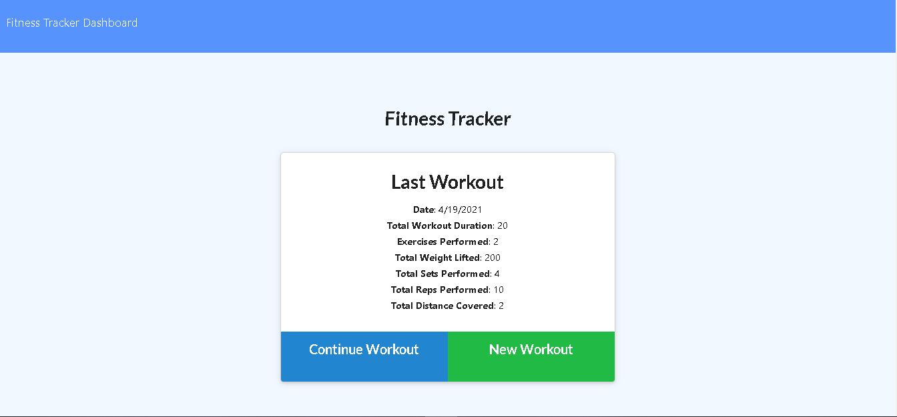
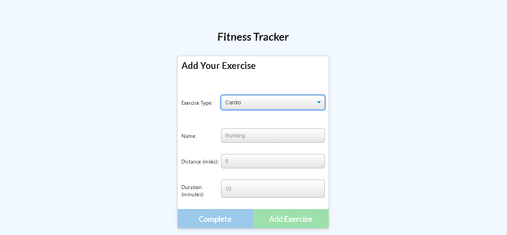
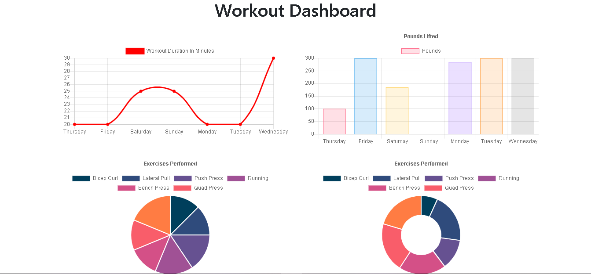

# Fitness-Tracker

## Table of Contents

* [Application Link](#application%20link)
* [Repository Link](#repository%20link)
* [Description](#description)
* [Usage](#usage)
* [Credits](#credits)
* [License](#license)

## Application Link

https://fitness-tracker30.herokuapp.com/

## Repository Link

https://github.com/John-Paul-Grace/Fitness-Tracker

## Description

An application for users to track their exercises. The exercises are grouped into workouts. Information about the past seven workouts can be seen on the stats page.

## Usage

First, visit the application link. On the homepage, click "New Workout" to create a workout. Enter information about your exercise and click "Add Exercise" to add it to your workout. When you are done, click "Complete" to be taken to the summary page where information about your current workout can be seen. The dashboard button at the top of the page will take you to the stats page where you can see information about the past seven workouts.

---

---

## Credits

**Collaborators:** John Paul Grace

**Third-Party Assets:** Mongoose, MongoDB, and Express

## License

MIT License

Copyright (c) 2021 John Paul Grace

Permission is hereby granted, free of charge, to any person obtaining a copy
of this software and associated documentation files (the "Software"), to deal
in the Software without restriction, including without limitation the rights
to use, copy, modify, merge, publish, distribute, sublicense, and/or sell
copies of the Software, and to permit persons to whom the Software is
furnished to do so, subject to the following conditions:

The above copyright notice and this permission notice shall be included in all
copies or substantial portions of the Software.

THE SOFTWARE IS PROVIDED "AS IS", WITHOUT WARRANTY OF ANY KIND, EXPRESS OR
IMPLIED, INCLUDING BUT NOT LIMITED TO THE WARRANTIES OF MERCHANTABILITY,
FITNESS FOR A PARTICULAR PURPOSE AND NONINFRINGEMENT. IN NO EVENT SHALL THE
AUTHORS OR COPYRIGHT HOLDERS BE LIABLE FOR ANY CLAIM, DAMAGES OR OTHER
LIABILITY, WHETHER IN AN ACTION OF CONTRACT, TORT OR OTHERWISE, ARISING FROM,
OUT OF OR IN CONNECTION WITH THE SOFTWARE OR THE USE OR OTHER DEALINGS IN THE
SOFTWARE.